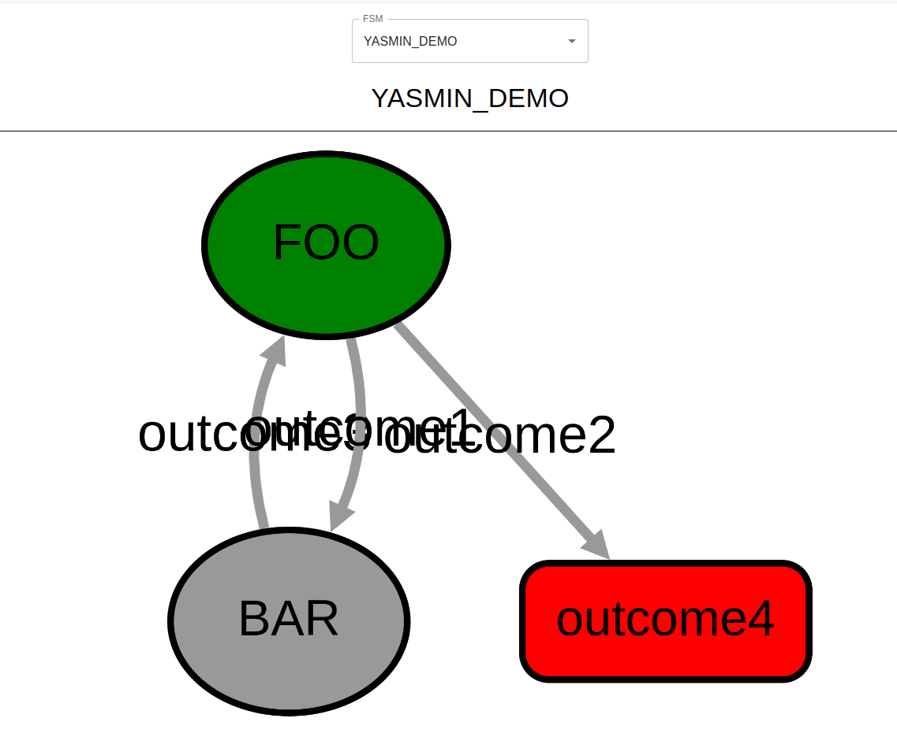
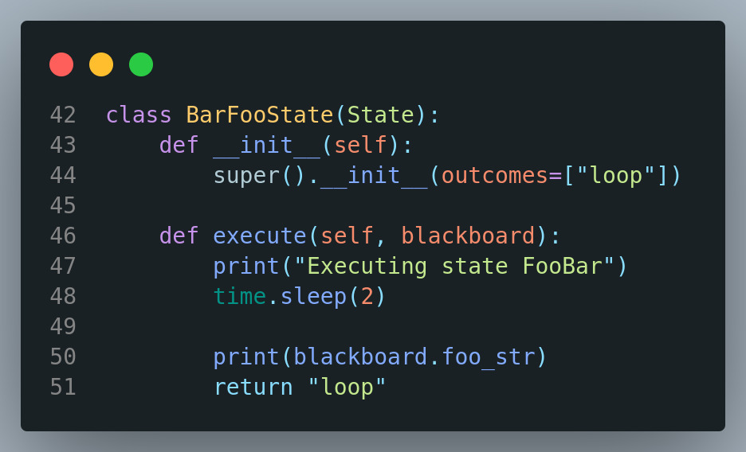
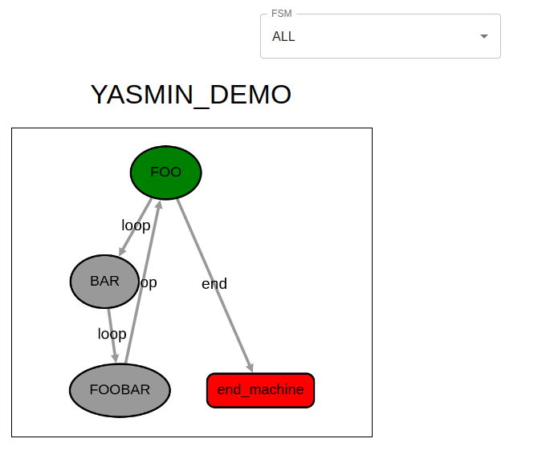
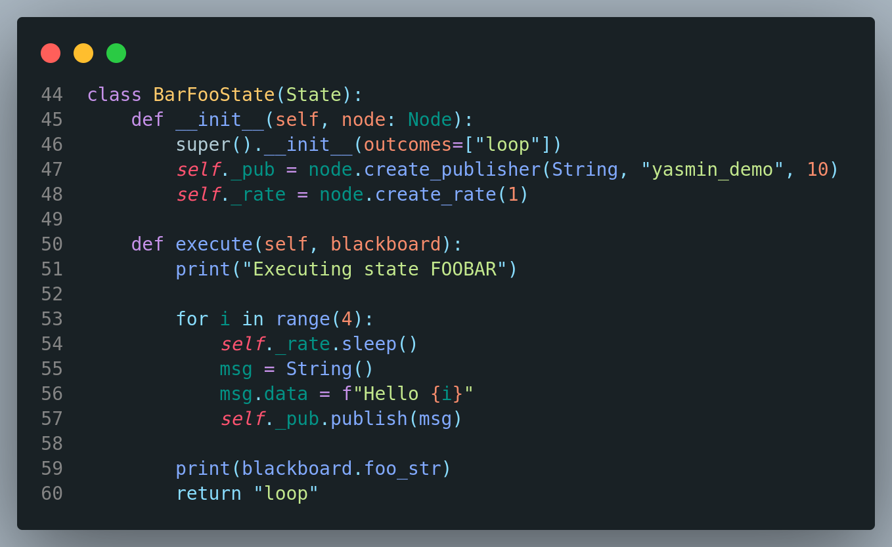
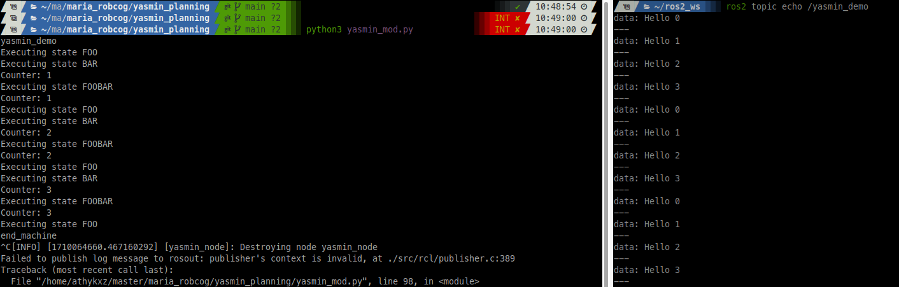
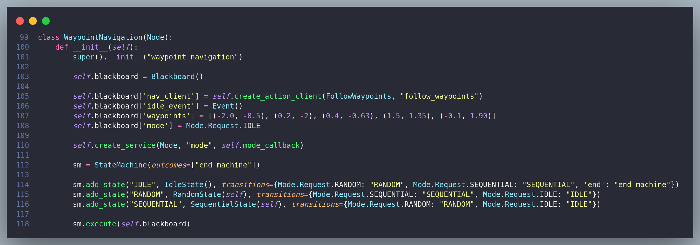
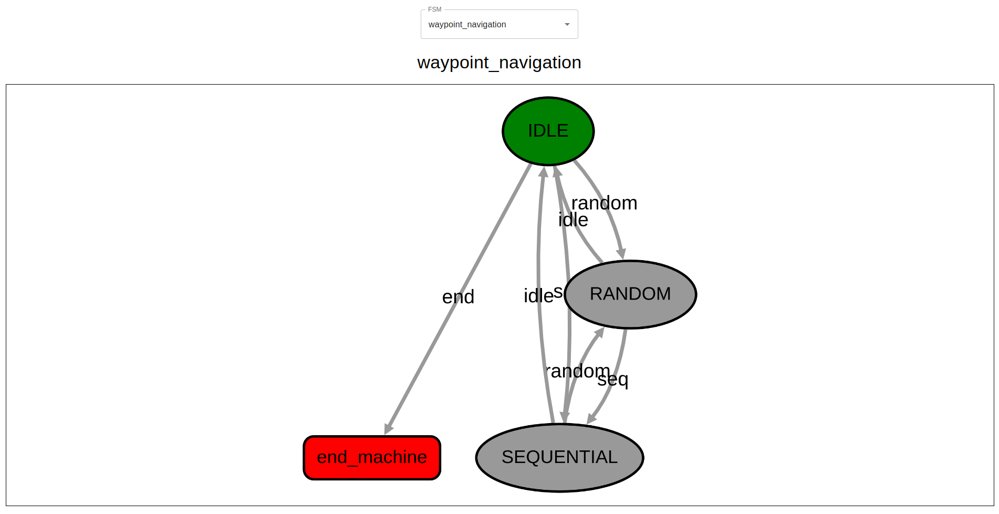

# 1. Uso de Yasmin

## a. Revisa y transcribe el ejemplo básico

En este ejemplo se cuenta con dos estados: FOO y BAR, se comienza el estado FOO y se termina la ejecución una vez se llegue a 'outcome4'.

En el estado de FOO, el sistema se duerme durante 3 segundos, y según las veces que se haya ejecutado el estado, se devuelve 'outcome1' o 'outcome2'. BAR duerme durante 3 segundos y devuelve outcome3. El funcionamiento de la máquina es el siguiente: A la tercera ejecución de FOO, se termina. En ejecuciones intermedias, el estado se cambia a BAR, que duerme y devuelve el estado actual a FOO.

## b. Modifica el ejemplo básico

Se ha añadido el estado BARFOO, que duerme durante dos segundos y se comunica de forma cíclica con el resto de la máquina. También se ha cambiado el nombre de las transiciones para una mejor interpretabilidad.

## c. Blackboard

El 'blackboard' en un sistema de memoria compartida donde todos los nodos pueden acceder a las variables que se describen en este espacio. Este sistema permite la comunicación entre nodos simple y eficaz, ya que cada nodo puede acceder a este nodo durante su tiempo de ejecución. Los problemas de este sistema son los problemas de utilizar memoria compartida: sin mecanismos de sincronización, puede haber inconsistencias o condiciones de carrera, puede ser más difícil de conocer quién modifica el blackboard o puede provocar fallos de seguridad.

## d. Nodo con publisher

Se ha modificado el ejemplo anterior para que el nodo FOOBAR publique sobre el topic '/yasmin_demo'. Este nuevo nodo escribe en el topic 'Hello i' cada segundo hasta 4 veces, para finamente cambiar de estado.
Para ello, se ha utilizado el método para crear el publisher dentro del constructor del Estado utilizando la implementación de SimpleNode, que gestiona los 'waits' del nodo de forma concurrente, por lo que el escalado de esta máquina sería posible.

## e. Waypoint Navigation con Yasmin

Se han implementado las máquinas de estado con el ejercicio de navegación de waypoints. Para ello, se ha contado con tres estados: "Aleatoria", "Secuencial" y "Parado". Se puede cambiar entre los 3 estados desde cualquier estado.

